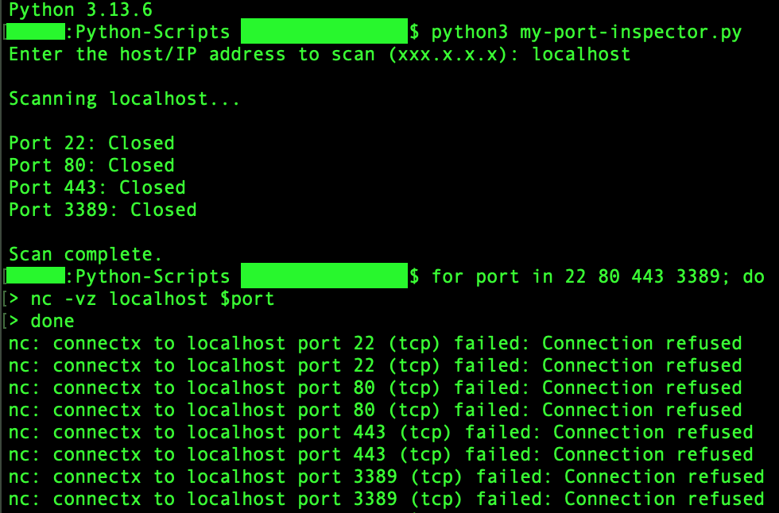

# myPort Inspector

A beginner-friendly Python-based port scanner that verifies whether common ports on your system(s) are open or closed.

This project demonstrates Python basics, networking knowledge, and safe coding practices.

---

## Features

- myPort Inspector scans default common ports:
  - 22 (SSH)
  - 80 (HTTP)
  - 443 (HTTPS)
  - 3389 (Remote Desktop)
- Displays status for each port: Open, Closed, Timeout, Invalid host, or Error
- Uses temporary TCP sockets, which close automatically after each check
- Simple, readable, beginner-friendly Python code can be customized:
  - Add additional ports
  - Adjust the timeout (e.g., slower networks, virtual machines, remote devices, etc.)

---

## Example Run

Testing of the scanner with verification using Netcat (`nc`):



---

## Skills Demonstrated

- Shows ability to write Python functions and use built-in modules (`socket`)
- Demonstrates understanding of networking concepts: ports, sockets, and timeouts
- Includes safe error handling and clear program flow
- Verified results with command-line tools (netcat)

## Requirements

- Python 3.x
- No external libraries needed

---

## How to Run

1. Open a terminal in the folder containing `my-port-inspector.py`
2. Run the script
3. Enter a host/IP address when prompted
4. The scanner will display the status of each common port

```bash
python3 my-port-inspector.py
```

## License

This project is licensed under the MIT License.
